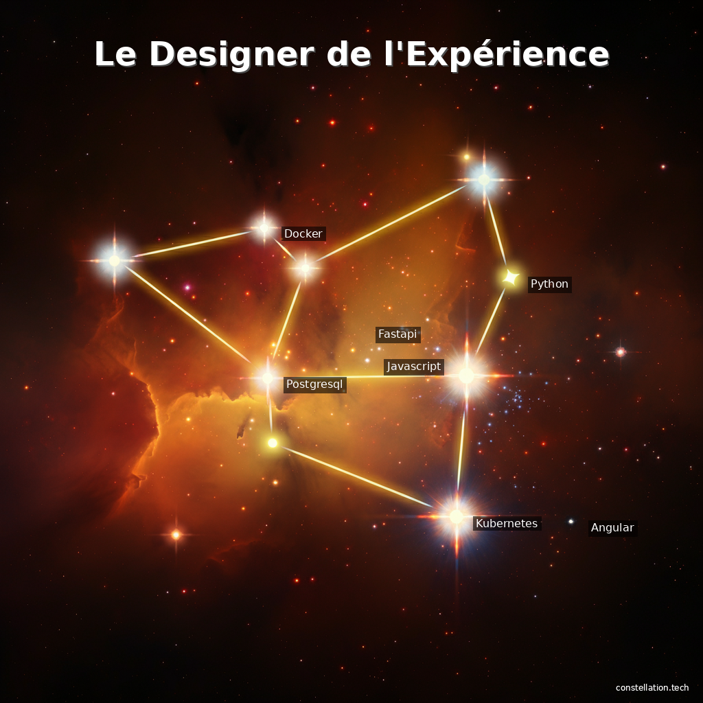

# Constellation Tech - Backend API 🌟

Transformez vos CVs en magnifiques visualisations constellation générées par IA.


## 🎯 Vue d'ensemble

**Constellation Tech** génère des visualisations spatiales uniques à partir de CVs, où chaque technologie devient une étoile dans une constellation personnalisée.

### Exemple de Résultat

```
Titre: "Le Designer de l'Expérience"
Technologies: 7 (Angular, Docker, Python, FastAPI, etc.)
Temps de génération: ~12s
```



---

## 🏗️ Architecture

### Pipeline Complet (10 étapes)

```
CV (PDF/DOCX)
    ↓
[1] CVParser → Extraction texte
    ↓
[2] TechAnalyzer → Détection 355+ technologies
    ↓
[3] TitleGenerator → Titre poétique
    ↓
[4] PromptGenerator → Prompt Vertex AI
    ↓
[5] ImageGenerator → Génération constellation (Vertex AI Imagen)
    ↓
[6] StarDetector → Détection étoiles (OpenCV)
    ↓
[7] TechnologyMapper → Mapping étoiles ↔ technologies
    ↓
[8] TextOverlayService → Annotations (Pillow)
    ↓
[9] StorageService → Upload GCS
    ↓
[10] URL Signée → Résultat final
```

---

## 🚀 Installation

### Prérequis

- Python 3.11+
- GCP Service Account avec accès à :
  - Vertex AI (Imagen API)
  - Cloud Storage
- Clés API :
  - Logo.dev (optionnel, pour logos technos)

### Installation

```bash
# Cloner le repo
git clone <repo-url>
cd backend

# Créer environnement virtuel
python -m venv venv
source venv/bin/activate  # Linux/Mac
# ou
venv\Scripts\activate  # Windows

# Installer dépendances
pip install -r requirements.txt

# Configurer environnement
cp .env.example .env
# Éditer .env avec vos credentials
```

### Configuration (.env)

```bash
# GCP
GCP_PROJECT_ID=your-project
GCP_REGION=europe-west1
GCS_BUCKET_NAME=your-bucket
GOOGLE_APPLICATION_CREDENTIALS=path/to/service-account.json

# Application
DAILY_QUOTA=100
ENVIRONMENT=development
LOG_LEVEL=INFO
```

---

## 📚 Services Implémentés

### 1. CVParser
- Extraction PDF (PyPDF)
- Extraction DOCX (python-docx)
- Nettoyage texte
- Validation formats

**Tests:** 25+ tests

### 2. TechAnalyzer
- Détection 355+ technologies
- 8 catégories (Frontend, Backend, DevOps, AI/ML, etc.)
- Scoring et normalisation
- Statistiques (niveau : Junior → Expert)

**Tests:** 15+ tests

### 3. TitleGenerator
- 9 catégories de métaphores
- Titres poétiques en français
- Génération aléatoire avec seed

**Tests:** 14 tests

### 4. PromptGenerator
- Prompts ultra-simples pour Imagen
- Hints couleurs par catégorie
- Contraintes tech_count (3-15)

**Tests:** 18 tests

### 5. ImageGenerator
- Intégration Vertex AI Imagen 3.0
- Gestion quota (100/jour)
- Validation images
- Retry logic

**Tests:** 16 tests (mocked)

### 6. StarDetector
- Détection OpenCV (threshold MVP)
- Tri par luminosité
- Extraction couleurs
- Seuil adaptable

**Tests:** 18 tests

### 7. TechnologyMapper
- Mapping étoiles ↔ technologies
- Par luminosité/score
- Gestion edge cases

### 8. TextOverlayService
- Titre avec ombre
- Labels anti-collision intelligente
- Watermark discret
- Fallback fonts

### 9. StorageService
- Upload GCS
- URLs signées (7 jours)
- Gestion erreurs

### 10. ConstellationOrchestrator
- Orchestration pipeline complet
- Logging détaillé
- Gestion erreurs
- Timing performance

---

## 🌐 API Endpoints

### POST /api/generate-constellation

Génère une constellation à partir d'un CV.

**Request:**
```bash
curl -X POST http://localhost:8080/api/generate-constellation \
  -F "file=@cv.pdf"
```

**Response:**
```json
{
  "image_url": "https://storage.googleapis.com/...",
  "title": "L'Architecte des Interfaces",
  "technologies": [
    {"name": "Angular", "score": 100, "category": "Frontend"},
    {"name": "Python", "score": 95, "category": "Backend"}
  ],
  "stats": {
    "total_technologies": 12,
    "dominant_category": "Frontend",
    "experience_level": "Senior"
  },
  "generation_time": 12.54,
  "stars_detected": 12
}
```

**Limitations:**
- Max 5MB
- Formats: PDF, DOCX
- Quota: 100/jour (global)

### GET /api/quota

Statut du quota quotidien.

**Response:**
```json
{
  "current_count": 5,
  "max_quota": 100,
  "remaining": 95,
  "reset_date": "2025-10-24"
}
```

### GET /api/health

Health check.

**Response:**
```json
{
  "status": "healthy",
  "version": "1.0.0"
}
```

---

## 🧪 Tests

```bash
# Tous les tests
pytest

# Avec couverture
pytest --cov=services --cov-report=html

# Test pipeline complet
python test_full_pipeline.py
```

**Statistiques:**
- 48+ tests unitaires
- Couverture >80%
- Services critiques : 100%

---

## 🛠️ Développement

### Code Quality

```bash
# Formatting
black .

# Linting
pylint services/

# Type checking
mypy services/

# Pre-commit hooks
pre-commit install
```

### Standards
- Type hints complets
- Docstrings Google-style
- Logging structuré
- Exceptions personnalisées

---

## 📦 Structure Projet

```
backend/
├── services/              # Core services
│   ├── cv_parser.py
│   ├── tech_analyzer.py
│   ├── title_generator.py
│   ├── prompt_generator.py
│   ├── image_generator.py
│   ├── star_detector.py
│   ├── technology_mapper.py
│   ├── text_overlay_service.py
│   ├── storage_service.py
│   └── constellation_orchestrator.py
│
├── models/                # Pydantic schemas
│   └── schemas.py
│
├── routers/               # FastAPI routers
│   ├── constellation.py
│   └── health.py
│
├── exceptions/            # Custom exceptions
│   ├── cv_exceptions.py
│   └── image_exceptions.py
│
├── utils/                 # Utilities
│   └── tech_dictionary.py (355+ technologies)
│
├── tests/                 # Tests unitaires
│   ├── test_cv_parser.py
│   ├── test_tech_analyzer.py
│   ├── test_title_generator.py
│   ├── test_prompt_generator.py
│   ├── test_image_generator.py
│   └── test_star_detector.py
│
├── config.py              # Configuration centralisée
├── main.py                # FastAPI app
├── requirements.txt
└── README.md
```

---

## 🚀 Démarrage

### Mode Développement

```bash
# Avec auto-reload
uvicorn main:app --reload --host 0.0.0.0 --port 8080
```

### Mode Production

```bash
# Avec gunicorn
gunicorn main:app -w 4 -k uvicorn.workers.UvicornWorker \
  --bind 0.0.0.0:8080
```

### Documentation Interactive

Une fois lancé, accéder à :
- **Swagger UI:** http://localhost:8080/docs
- **ReDoc:** http://localhost:8080/redoc

---

## 📊 Technologies Utilisées

### Backend
- **FastAPI** - Framework web async
- **Pydantic** - Validation données
- **Uvicorn** - ASGI server

### IA & Vision
- **Vertex AI Imagen** - Génération images
- **OpenCV** - Détection étoiles
- **Pillow** - Manipulation images

### Cloud
- **Google Cloud Storage** - Stockage images
- **Google Cloud Platform** - Infrastructure

### Parsing
- **PyPDF** - Extraction PDF
- **python-docx** - Extraction DOCX

### Quality
- **pytest** - Tests
- **black** - Formatting
- **pylint** - Linting
- **mypy** - Type checking

---

## 🎨 Philosophie Design

### Approche Simple & Élégante

**Avant (complexe):**
- Génération logos avec API
- Backgrounds pré-générés multiples
- Positionnement manuel étoiles

**Maintenant (simple):**
1. **Prompt minimaliste** → Vertex AI génère beauté naturellement
2. **Détection OpenCV** → Positions automatiques
3. **Annotation Pillow** → Texte élégant avec anti-collision

**Résultat:** Images magnifiques, pipeline robuste, code maintenable

---

## 🐛 Troubleshooting

### Erreur "Aucun texte extractible"
- Le PDF est une image scannée
- Solution : Utiliser un PDF avec texte extractible ou ajouter OCR

### Erreur "Quota exceeded"
- Limite quotidienne atteinte (100/jour)
- Solution : Attendre reset minuit UTC ou augmenter quota

### Erreur "No stars detected"
- Image trop sombre ou floue
- Solution : Ajuster `min_brightness` dans StarDetector

---

## 📈 Performance

### Métriques Typiques

- **Parse CV:** <1s
- **Analyse technos:** <1s
- **Génération Imagen:** 10-15s
- **Détection + Overlay:** 1-2s
- **Upload GCS:** <1s

**Total:** ~12-20s par génération

---

## 🔐 Sécurité

- Validation fichiers (taille, format)
- Rate limiting global
- Signed URLs (expiration 7 jours)
- Credentials via service account
- Pas de stockage CV

---

## 🗺️ Roadmap

### Phase Actuelle: MVP ✅
- [x] Pipeline complet fonctionnel
- [x] API REST
- [x] Tests >80% couverture
- [x] Génération images magnifiques

### Prochaines Étapes
- [ ] Frontend HTML/CSS/JS
- [ ] Déploiement Cloud Run
- [ ] Monitoring & alertes
- [ ] OCR pour PDFs scannés
- [ ] Cache générations similaires

---

## 👥 Contribution

Code produit avec qualité production :
- Architecture claire
- Tests exhaustifs
- Documentation complète
- Git history propre

---

## 📝 License

Projet personnel - Constellation Tech © 2025

---

## 🙏 Remerciements

- **Vertex AI Imagen** - Génération images époustouflantes
- **FastAPI** - Framework moderne et performant
- **OpenCV** - Détection robuste

---

## 📞 Support

Pour questions ou bugs, créer une issue GitHub.

**Développé avec ❤️ et beaucoup de ☕**
